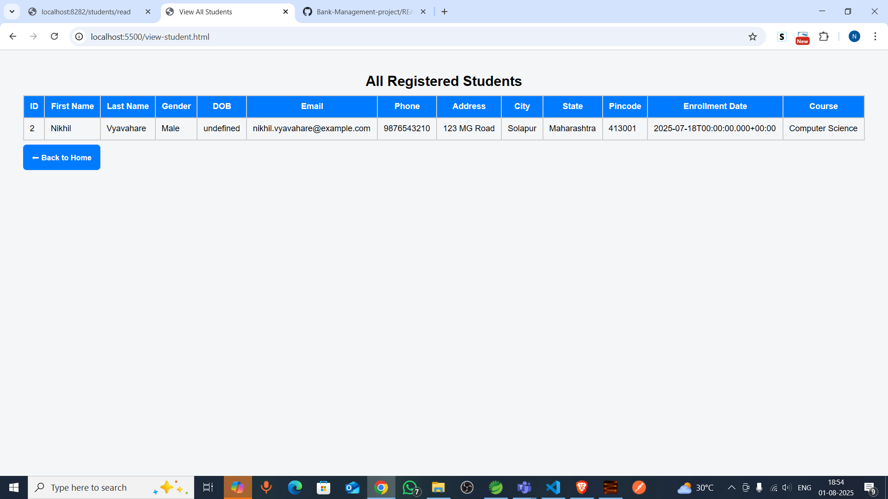
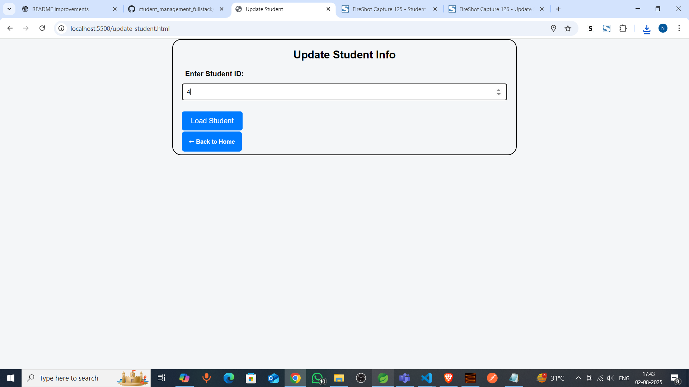
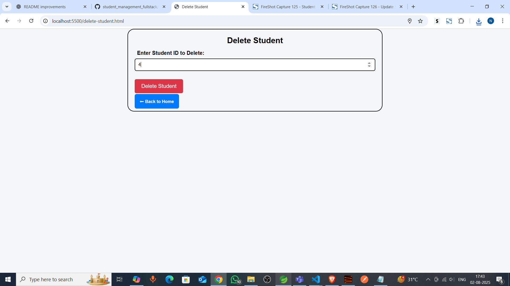
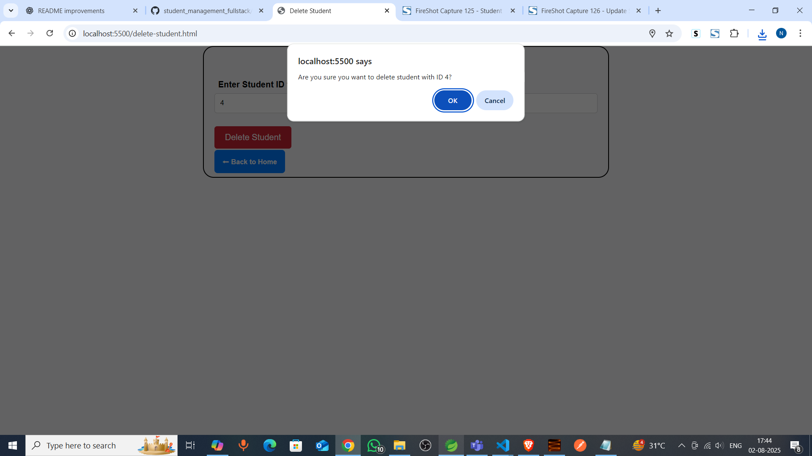
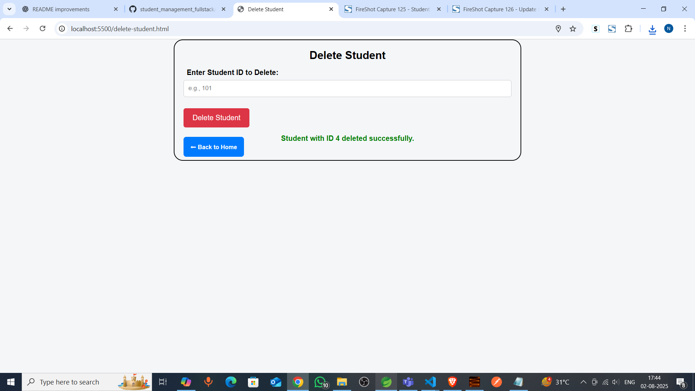

# 🎓 Student Management System

A simple web application for managing student data. Built using **Spring Boot** for the backend and **HTML, CSS, and JavaScript** for the frontend. This system allows users to **register**, **view**, **update**, and **delete** student records.

---

## 📌 Features

- 📋 **Register Students**  
  Add new students with full personal and academic details.

- 🔍 **View Students**  
  Fetch and display all student data in a dynamic table.

- ✏️ **Update Info**  
  Update existing student information based on Student ID.

- 🗑️ **Delete Students**  
  Remove student records securely by ID.

---

## 🚀 Live Demo

🔗 Live GitHub Hosted Link: https://nikhil-vyavahare.github.io/student_management_fullstack/  
*(Replace with your actual GitHub Pages link)*

---

## 🧠 Technologies Used

- **Backend:** Spring Boot, Java
- **Frontend:** HTML, CSS, JavaScript (Vanilla)
- **Data Format:** JSON
- **HTTP Client:** Fetch API

---

## 🖼️ Screenshots

### 🏠 Home Page

### 📑 View All Students

### 📝 Update Student

### 🗑️ Delete Student

---

## 📌 Features

- 📋 **Register Students**  
  Add new students with full personal and academic details.

- 🔍 **View Students**  
  Fetch and display all student data in a dynamic table.

- ✏️ **Update Info**  
  Update existing student information based on Student ID.

- 🗑️ **Delete Students**  
  Remove student records securely by ID.

---

## 🚀 Live Demo

🔗 Live GitHub Hosted Link: https://nikhil-vyavahare.github.io/student_management_fullstack/  
*(Replace with your actual GitHub Pages link)*

---

## 🧠 Technologies Used

- **Backend:** Spring Boot, Java
- **Frontend:** HTML, CSS, JavaScript (Vanilla)
- **Data Format:** JSON
- **HTTP Client:** Fetch API

---

## 🖼️ Screenshots

### 🏠 Home Page

### 📑 View All Students

### 📝 Update Student

### 🗑️ Delete Student

---

## 🏗️ Setup Instructions

### Backend (Spring Boot)

1. Open the project in your IDE.
2. Run `StudentCurdApplication.java` to start the server.
3. Ensure it's running at: `http://localhost:8080`.

### Frontend (HTML/JS/CSS)

1. Open `index.html` using **Live Server** extension in VS Code or any local server.
2. Ensure CORS is enabled (`@CrossOrigin`) in your controller (✅ Done).

---

## 🧪 API Endpoints

| Method | Endpoint                 | Description         |
|--------|--------------------------|---------------------|
| GET    | `/students/read`         | Fetch all students  |
| GET    | `/students/{id}`         | Fetch student by ID |
| POST   | `/students`              | Add new student     |
| PUT    | `/students/{id}`         | Update student      |
| DELETE | `/students/{id}`         | Delete student      |

---

## ✍️ Developer Info

**👨‍💻 Nikhil Vyavahare**  
📧 [nikhilvyavahare2@gmail.com](mailto:nikhilvyavahare2@gmail.com)  
🌐 [GitHub Profile](https://github.com/Nikhil-Vyavahare)

---

